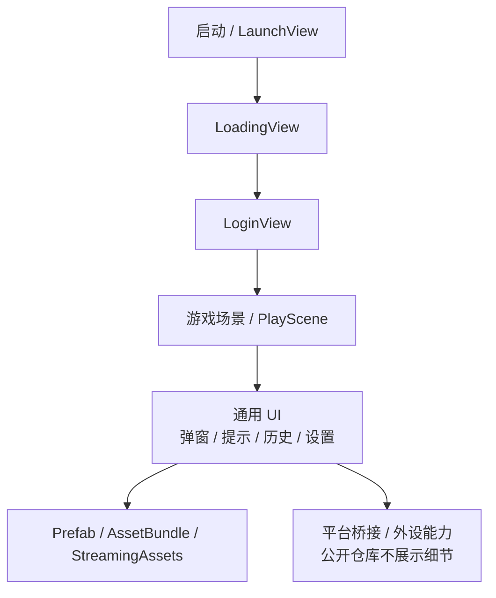

# 208-unity Showcase

> Unity 游戏前端展示仓库。原项目为私有项目，本仓库只公开脱敏后的项目说明、模块结构、流程图和职责说明，不公开源码、商业素材、平台桥接细节或业务配置。

## 项目简介

`208-unity` 是一个基于 Unity 的游戏前端项目，包含登录、加载、游戏场景、UI 面板、资源管理、AssetBundle、打印 / 外设相关设置界面和平台桥接目录等内容。该公开仓库用于展示 Unity 游戏项目经验和跨引擎开发能力。

## 技术栈

- Unity 5.x
- C#
- Unity UI
- Prefab / Scene
- AssetBundle
- StreamingAssets
- 外设 / 平台桥接相关流程

## 我负责的内容

- 参与 Unity 游戏前端开发和界面实现。
- 处理登录界面、加载界面、游戏场景、UI 资源和交互逻辑。
- 参与资源整理、Prefab 配置、场景配置和问题排查。
- 根据项目需要处理与外设、打印或平台桥接相关的前端流程。
- 使用 Codex 辅助梳理 Unity 项目结构、模块职责和公开展示说明。

## 脱敏目录职责

```text
Assets/
  src/                # C# 脚本、UI Prefab 和游戏前端资源，公开仓库不包含源码
  StreamingAssets/    # AssetBundle 和运行时资源，公开前需确认版权
ProjectSettings/      # Unity 项目配置，公开仓库不上传真实项目配置
208bridge/            # 平台桥接目录，公开仓库不披露桥接细节
```

## Unity 前端链路



## AI / Codex 使用方式

- 辅助梳理 Unity 项目结构、Prefab 命名和模块职责。
- 辅助将跨引擎项目经验整理为公开展示 README。
- 辅助生成脱敏目录说明、流程图和项目复盘内容。
